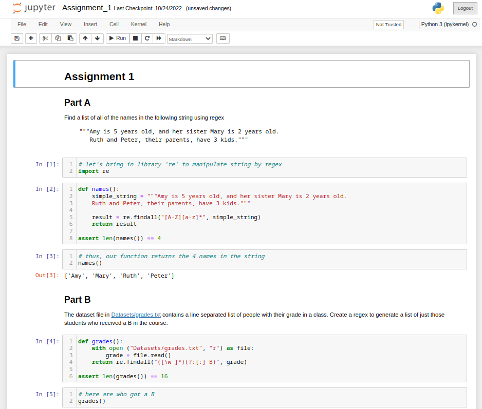
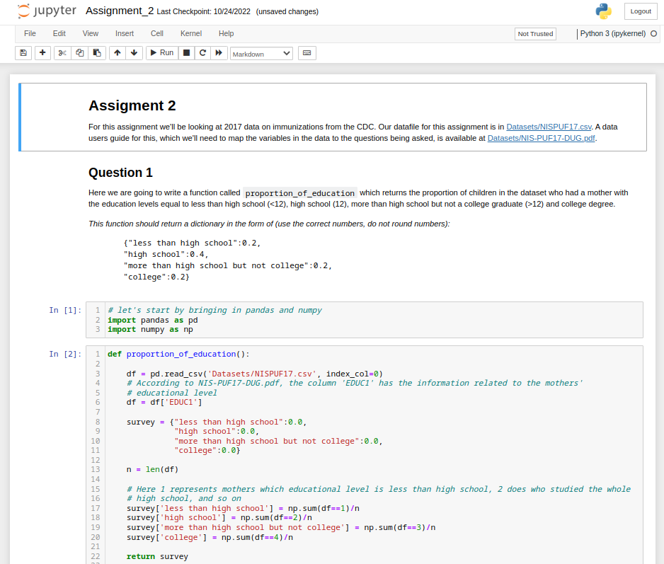
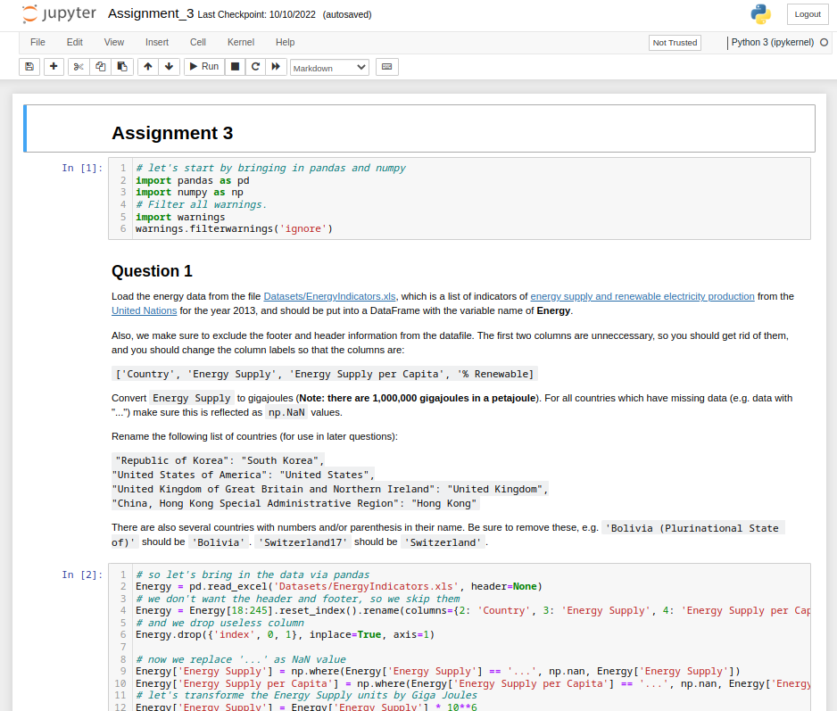
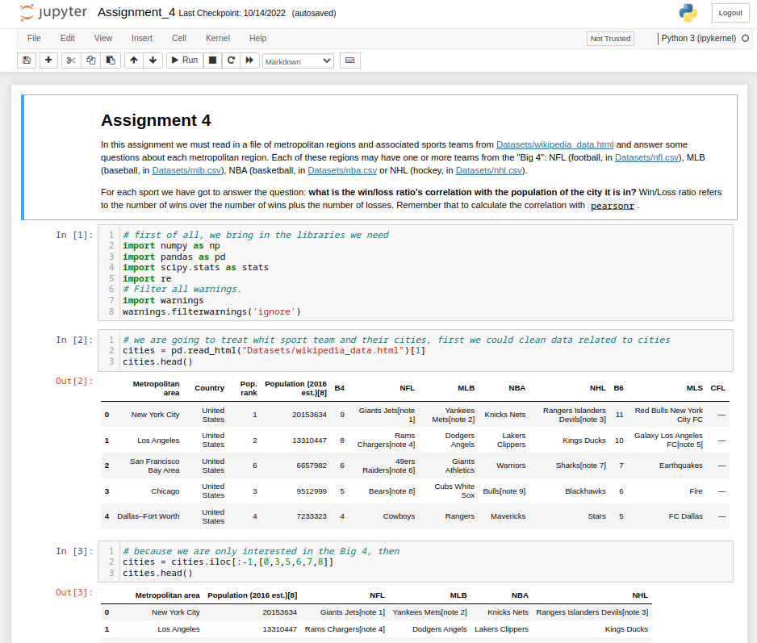

# Introduction to Data Science in Python
This repository contains the topics that taught in the coursera course *Introduction to Data Science in Python*, it contains the assigments as well.
These topics and assignments are gathered into different directories, according to weekly aims. The datasets used in the course are located in the
***Datasets*** directory of each week. Then each weekly aim is:
## First Week
> Here we manipulate and select data using numpy, as well as apply regular expresion to string data, and learn how to properly match string patterns.
> [(./Week_1/Assignment_1.ipynb)](https://github.com/jpradas1/Introduction_Data-Science_Python/blob/master/Week_1/Assignment_1.ipynb)
>
> 
## Second Week
> In this week we learn about the one of the most important python libraries, i.e., Pandas. Using this toolkit we can read in data into DataFrame structures,
> query these structures, and the details about such structures are indexed.
> [(./Week_2/Assignment_2.ipynb)](https://github.com/jpradas1/Introduction_Data-Science_Python/blob/master/Week_2/Assignment_2.ipynb)
>
> 
## Third Week
> Now we deepen our knowlegde in Pandas by learning how to merge DataFrames, generate summary tables, group data into logical pieces, and manipulate dates.
> [(./Week_3/Assignment_3.ipynb)](https://github.com/jpradas1/Introduction_Data-Science_Python/blob/master/Week_3/Assignment_3.ipynb)
>
> 
## Fourth Week
> This week gathers previous knowlegdes in python pandas library, so taking into account that we introduced to a variety of statistical techniques such a 
> distributions, sampling and t-tests, in order to get applied to datasets.
> [(./Week_3/Assignment_4.ipynb)](https://github.com/jpradas1/Introduction_Data-Science_Python/blob/master/Week_4/Assignment_4.ipynb)
>
> 
